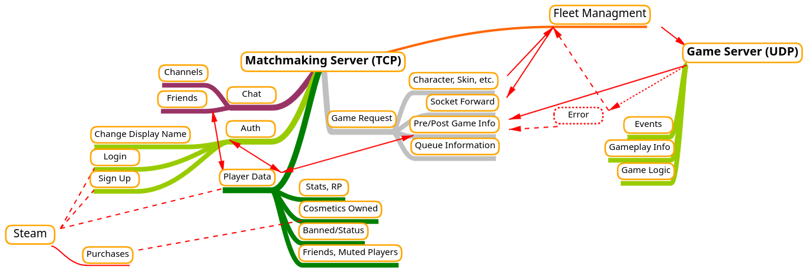

# Sylvan Row
A twin-stick hero shooter, with the ambition of avoiding hard-counter interactions, having simple but unique characters, playing on keyboard&mouse and controller, all while having a working anticheat despite being FOSS.


## Play

The game's development highly relies on player feedback, and the game is currently having scheduled playtests on [discord](https://discord.gg/4SbwGZeYcx).

There is a playable release, but you'll need to host your own server if you want to try the game. When you run the game, a file called `moba_ip.txt` will be created in the same directory. You can put your own server's IP address in there.

## Compile and run it yourself

Run the game:
```sh
cargo run --bin game --release # or ./client.sh
```
Run the server:
```sh
cargo run --bin server # or ./server.sh
```
Or build the binaries
```
cargo build --release
```

### Dependencies

On Linux, you need to additionally install `libudev-dev`, `libx11-dev` and `pkg-config` (apt package names) to compile the code.

## Other info

The GDD is in `assets/README.md`.

There is no documentation for the code yet.

Maps are made through `mapmaker.py`.

# To do

This is just for me.

## Main

- [ ] Characters
  - [ ] Rework Hernani secondary
  - [ ] Josey aim lazer shows ricochet
- [ ] Innovate gamemode
- [x] Rough menu
  - [x] Pause menu, always accessible
    - [x] Settings screen
      - [ ] Text input field
      - [ ] Input bar
      - [x] Checkbox
      - [ ] Drop-down menu
      - [ ] Keybind input field
  - [x] Home menu
    - [x] Tabs
      - [x] Play
      - [x] Heroes
      - [x] Tutorial
- [ ] Matchmaking server 
  - [ ] **Part 1** (for open beta)
    - [ ] Player data
      - [x] Username
      - [x] Password hash
      - [ ] Friends
      - [ ] Muted players
      - [ ] Ban status
    - [ ] Auth
      - [ ] Create account
        - [x] PAKE register
          - [x] Filters
            - [x] Basic filter
            - [ ] Profanity filter
          - [x] Check if already in use
        - [x] Username & password storage
      - [x] Log in
      - [x] Encryption
        - [x] Game server
        - [x] Matchmaking server
    - [ ] Chat
      - [ ] Channels
      - [ ] Friends
    - [ ] Game request
      - [ ] Lobby (request with friend)
      - [x] Character
    - [ ] Matchmaking
      - [x] Start game server
      - [ ] Match ends and gives info to server
        - [ ] Info given to clients
    - [ ] "Fleet" managment
      - [x] Single-machine 
      - [x] Error handling
        - [ ] Apologise to user
    - [ ] Logs
      - [ ] Chat logs (for moderation)
      - [ ] Server crash logs
  - [ ] Server survival
    - [ ] Throttling
    - [ ] Invalid account deletion
    - [ ] Database Efficiency
      - [ ] Table instead of serialized struct
    - [ ] No direct indexing[69], no ".expect()"
      - [ ] Reboot on failure
  - [ ] **Part 2** (for release)
    - [ ] Steam integration
      - [ ] Accounts
      - [ ] In-game purchases
        - [ ] Inform game request
      - [ ] Display name & change display name
  - [ ] UI
    - [x] Text input fields
- [ ] Remove all .unwrap() and .expect(), at least serverside
- [ ] Sound
  - [ ] Directional sound (kira crate)
  - [ ] Volume sliders in settings screen, etc
  - [ ] Music
    - [ ] beg Fancy or learn how to cook
  -  [ ] Sound effects
  -  [ ] Voicelines
    -  [ ] Character picked
    -  [ ] Character gets a kill
    -  [ ] Character wins
- [ ] Visual
  - [ ] Animation system
  - [ ] Scenery & prettier backgrounds
    - [ ] Background loader from file
  - [ ] Mirror the map
  - [ ] Revamp menu
- [x] Interpolation
  - [x] Self-interpolation on dashes
  - [x] Player interpolation for other players
  - [x] Make it optional
    - Currently just a variable. 
- [ ] Anticheat
  - [ ] Packet averaging
  - [ ] Hide certain information from client
- [ ] Publish game
  - [ ] Steam
  - [ ] Marketing
  - [ ] Server hosting
    - AWS sucks
- [ ] Android port
  - [ ] Android-specific controls (devicequery doesnt work)

## Side quests

- [ ] Change game engine
- [ ] Clean up code
  - [x] IMPORTANT: Reorganise mutexes to avoid deadlocks
    - Current implementation is silly
  - [ ] Health u8 -> f16
  - [ ] Server vulnerabilities
  - [ ] Variable names, readability
  - [ ] Organisation
    - [ ] structure into proper modules, like networking, maths, players, ui, etc...
  - [ ] Packet size
  - [ ] Write own parser

## Reminders
- Update Wiro projectile list when new char
- Update wall list when new wall

## Issues that won't be solved

- Fullcreen issue on Linux (Macroquad issue)
  - [x] Holy shit they fixed it
- Icon doesn't show up on Linux (Macroquad issue)
  - [x] Holy guacamole they fixed it

# Notes

This was previously owned by OrnitOnGithub, my alt account, as mentioned [in the original repository](https://github.com/OrnitOnGithub/moba?tab=readme-ov-file#notice)

## Extra credits

- MylesDeGreat on deviantart for inspiration on the sword slash sprite
- posemy.art for reference images
- Inspiration
  - Assault Android Cactus
  - Battlerite