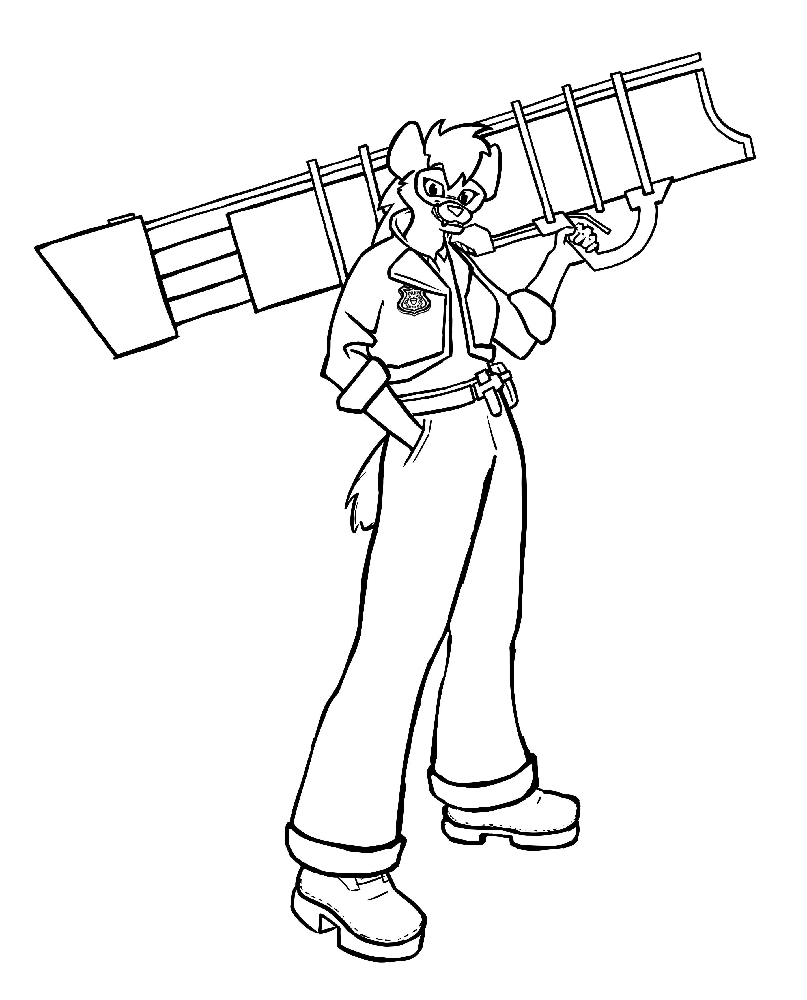

# Sylvan Row

A multiplayer twin-stick hero shooter designed to be fair and fun while still allowing a high skill ceiling.

 

## Play

If you're interested in playtesting we'd love to have you over at our [Discord](https://discord.gg/4SbwGZeYcx)! Or the [Stoat server](https://stt.gg/7GvZ7HfA), if you're chill like that.

Otherwise there is a playable release, but you'll need to host your own server if you want to try the game (by downloading server.exe). When you run the game, a file called `moba_ip.txt` will be created in the same directory. You can put your own server's IP(v4) address in there.

## Compile and run it yourself

You can build the binaries with cargo
```sh
cargo build --release
```

Or directly run the game:
```sh
cargo run --bin game --release # or ./client.sh
```
Or the server:
```sh
cargo run --bin server # or ./server.sh
```

### Dependencies

On Linux, you need to additionally install `libudev-dev`, `libx11-dev` and `pkg-config` (apt package names) to compile the code.

## Other info

There is no documentation for the code yet, as a lot of it is in a temporary state.

The GDD is in `assets/README.md`.

## To do

This is just for me.

## Main

- [ ] Characters
  - [x] Rework Hernani secondary
  - [ ] Josey aim lazer shows ricochet
- [ ] Innovate gamemode
- [x] Rough menu
  - [x] Pause menu, always accessible
    - [x] Settings screen
      - [ ] Text input field
      - [ ] Input bar
      - [x] Checkbox
      - [ ] Drop-down menu
      - [ ] Keybind input field
  - [x] Home menu
    - [x] Tabs
      - [x] Play
      - [x] Heroes
      - [x] Tutorial
- [ ] Matchmaking server
  - [ ] **Part 1** (for open beta)
    - [x] Easier and more reliable netcode
      - [x] TCP
      - [ ] UDP
    - [ ] Player data
      - [x] Username
      - [x] Password hash
      - [x] Friends
      - [x] Blocked players
        - [ ] Interface
      - [x] Stats
        - [x] Win count
      - [ ] Ban status
    - [x] Auth
      - [x] Create account
        - [x] PAKE register
          - [x] Filters
            - [x] Basic filter
            - [ ] Profanity filter
          - [x] Check if already in use
        - [x] Username & password storage
      - [x] Log in
      - [x] Encryption
        - [x] Game server
        - [x] Matchmaking server
    - [x] Chat
      - [x] Channels
      - [x] Friends (PM)
        - [ ] ISSUE: Selected friend is a numerical index, which can change the selected friend on refresh.
    - [x] Game request
      - [x] Lobby (request with friend)
        - [x] Serverside (untested)
      - [x] Character
    - [x] Matchmaking
      - [x] Start game server
      - [x] Match ends and gives info to server
        - [ ] Info given to clients
    - [x] "Fleet" managment
      - [x] Single-machine 
      - [x] Error handling
        - [ ] Apologise to user
    - [x] Logs
      - [ ] Chat logs (for moderation)
      - [x] Server crash logs
  - [x] UI
    - [x] Text input fields
  - [ ] Ranked system
    - [ ] Ranked queue
    - [ ] Ranked points storage
    - [ ] Ranked points assignment at win/loss
    - [ ] Rank update display at end of game
    - [ ] Ranked Leaderboard
  - [x] Maintain ability to read primary server socket during game
    - [x] In-game chat
    - [x] Game update (game won/lost)
  - [x] Practice mode
  - [x] Offline mode
  - [ ] Server survival
    - [ ] Throttling
    - [ ] Invalid account deletion
    - [ ] Database Efficiency
      - [ ] Table instead of serialized struct
    - [ ] No direct indexing[69], no ".expect()"
      - [ ] Reboot on failure
  - [ ] **Part 2** (for release)
    - [ ] Steam integration
      - [ ] Accounts
      - [ ] In-game purchases
        - [ ] Inform game request
      - [ ] Display name & change display name
- [ ] Remove all .unwrap() and .expect(), at least serverside
- [ ] Sound
  - [ ] Directional sound (kira crate)
  - [ ] Volume sliders in settings screen, etc
  - [ ] Music
    - [ ] beg Fancy or learn how to cook
  -  [ ] Sound effects
  -  [ ] Voicelines
    -  [ ] Character picked
    -  [ ] Character gets a kill
    -  [ ] Character wins
- [ ] Visual
  - [ ] Animation system
  - [ ] Scenery & prettier backgrounds
    - [ ] Background loader from file
  - [ ] Mirror the map
  - [ ] Revamp menu
- [x] Interpolation
  - [x] Self-interpolation on dashes
  - [x] Player interpolation for other players
  - [x] Make it optional
    - Currently just a variable.
- [ ] Anticheat
  - [ ] Packet averaging
  - [ ] Hide certain information from client
- [ ] Publish game
  - [ ] Steam
  - [ ] Marketing
  - [ ] Server hosting
    - AWS sucks
- [ ] Android port
  - [ ] Android-specific controls (devicequery doesnt work)

### Bugs

- [x] Parties requeue without consent
- [x] 4 players don't always get matchmade 2v2
  - [x] When the party leader leaves the party, other players aren't properly informed of the new leader, it's still the old leader.
- [x] Gameserver's `owner_port` has to be reworked into `owner_username`.
- [ ] Weird indexing errors in gameserver.

## Side quests

- [ ] Change game engine
- [ ] Clean up code
  - [x] IMPORTANT: Reorganise mutexes to avoid deadlocks
  - [ ] Health u8 -> f16
  - [ ] Server vulnerabilities
  - [ ] Variable names, readability
  - [ ] Organisation
    - [ ] structure into proper modules, like networking, maths, players, ui, etc...
  - [ ] Packet size
  - [ ] Write own parser

## Reminders
- Update Wiro projectile list when new char
- Update wall list when new wall

## Issues that won't be solved

- Fullcreen issue on Linux (Macroquad issue)
  - [x] Holy shit they fixed it
- Icon doesn't show up on Linux (Macroquad issue)
  - [x] Holy guacamole they fixed it
- Any MITM mitigation that goes beyond making sure data is secure and legitimate.

# Notes

This was previously owned by OrnitOnGithub, my alt account, as mentioned [in the original repository](https://github.com/OrnitOnGithub/moba?tab=readme-ov-file#notice)

## Extra credits

- MylesDeGreat on deviantart for inspiration on the sword slash sprite
- posemy.art for reference images
- Inspiration
  - Assault Android Cactus
  - Battlerite
  - League of Legends