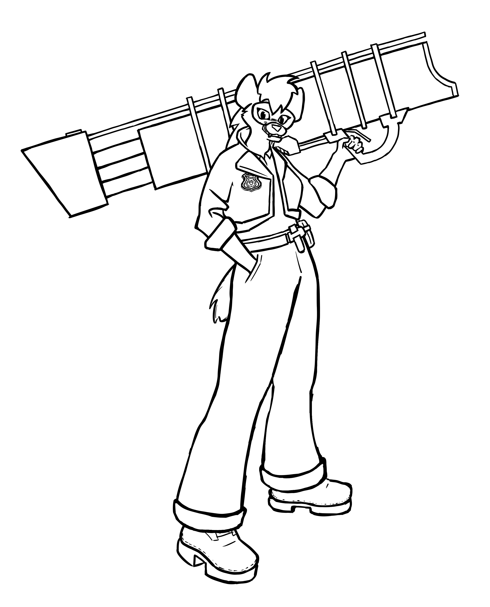

# Sylvan Row

A multiplayer twin-stick hero shooter designed to be fair and fun while still allowing a high skill ceiling.

 

## Play

If you're interested in playtesting we'd love to have you over at our [Discord](https://discord.gg/4SbwGZeYcx)!

Otherwise there is a playable release with a working offline mode, but you'll need to host your own server if you want to try the game with others.
When you run the game, a file called `moba_ip.txt` will be created in the same directory. You can put your own server's IP(v4) address in there.

## Compile and run it yourself

You can build the binaries with cargo
```sh
cargo build --release
```

Or directly run the game:
```sh
cargo run --bin game --release # or ./client.sh
```
Or the server:
```sh
cargo run --bin server # or ./server.sh
```

Always build the game with `--release`, otherwise the game will run very poorly.

### Dependencies

On Linux, you need to additionally install `libudev-dev`, `libx11-dev` and `pkg-config` (apt package names) to compile the code.

## Other info

There is no documentation for the code yet, as a lot of it is in a temporary state.

The GDD is in `assets/README.md`.

## To do

This is just for me.

- [ ] Bevy swap
  - [ ] Clean up input handling too
  - [ ] Android port, thanks to bevy
    - [ ] Fix performance issue
- [ ] Characters
  - [ ] Sága
  - [ ] The assassin
- [ ] Ranked system
- [ ] Server stuff
  - [ ] chat filter
  - [ ] throttling, etc...
- [ ] Better anticheat
- [ ] Art
  - [x] Animation system
    - [ ] animations
  - [ ] Maps with https://www.mapeditor.org/
  - [ ] Menu
  - [ ] Better sfx & vfx

- [ ] Bugs
  - [x] Raphaelle movspeed bonus too high
  - [ ] show "slow" instead of "- speed"
  - [ ] ability tooltips have confusing ability naming. integrate with keybinds.

- [ ] Dev QOL
  - [ ] Cleaner code
  - [ ] Own parser for character properties that allows comments

### Bugs

- [x] Parties requeue without consent
- [x] 4 players don't always get matchmade 2v2
  - [x] When the party leader leaves the party, other players aren't properly informed of the new leader, it's still the old leader.
- [x] Gameserver's `owner_port` has to be reworked into `owner_username`.
- [ ] Weird indexing errors in gameserver.

## Reminders
- Update Wiro projectile list when new char
- Update wall list when new wall

## Issues that won't be solved

- Fullcreen issue on Linux (Macroquad issue)
  - [x] Holy shit they fixed it
- Icon doesn't show up on Linux (Macroquad issue)
  - [x] Holy guacamole they fixed it
- Any MITM mitigation that goes beyond making sure data is secure and legitimate.

# Notes

This was previously owned by OrnitOnGithub, my alt account, as mentioned [in the original repository](https://github.com/OrnitOnGithub/moba?tab=readme-ov-file#notice)

## Extra credits

- MylesDeGreat on deviantart for inspiration on the sword slash sprite
- posemy.art for reference images
- Inspiration
  - Assault Android Cactus
  - Battlerite
  - League of Legends